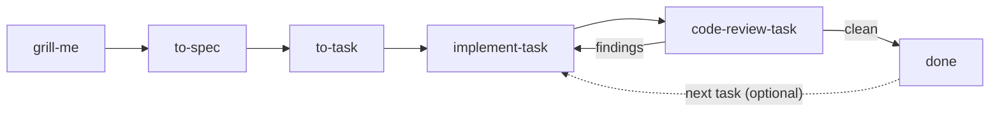

# Workflow 2: Complex Changes

```mermaid
flowchart LR
    A[grill-me] --> B[to-spec] --> C[to-task] --> D[implement-task] --> E[code-review-task]
    E -->|findings| D
    E -->|clean| F[done]
    F -. next task (optional) .-> D
```
